# Go Tennis System

This is a website designed to help people interested in one on one tennis coaching receive this online. By putting this service online it doesn't restrict where the user
is in the world or any problems like the pandemic of which we are currently facing. Also this will help users with their own video diary so they can see how much they have progressed.

## Showcase

A deployed version of my website can be found [here](https://andrewh1188.github.io/go-tennis-ms1/)

This domain will allow you to access the Go Tennis System website, which I have completed as part of the Code Institute Milestone 1 Project.

This website is designed to be responsive on a range of devices and browsers, allowing access to anyone that is interested in the service Go Tennis System are offering.

## Table of Contents
1. [User Experience UX](#user-experience-ux)
    * [User Stories](#user-stories) 
        * [As a new / first time user](#new-first-time-user)
        * [Returning Visitor Goals](#returning-visitor-goals)
        * [Frequent User Goals](#frequent-user-goals)
        * [User Customer Goals](#user-goals)
        * [Business Goals](#business-goals)
        * [Scope](#scope)   
        * [Structure](#structure) 
    * [Design](#design)
    * [Imagery](#imagery)
    * [Wireframes](#wireframes)
2. [Features](#features)
    * [Existing-features](#existing-features)
    * [Future-features](#future-features)
3. [Technologies and Languages Used](#technologies)
    * [Other Resources](#other-resources) 
4. [Testing](#testing)
    * [Implementation](#implementation)
    * [Results](#results)
    * [Bugs](#bugs)
5. [Deployment](#deployment)
6. [Credits](#credits)
    * [Content](#content)
    * [Media](#media)
    * [Acknowledgments](#acknowledgments)

## User Experience UX 
I have designed this website for my Tennis coach Adam Jameel who is starting up his own business.  
This website is to allow users to have video lessons and tutorials wherever they are in the world.  
This has been bought about because of the current pandemic and my Tennis coach wanting to keep people fit, training as well as keep their physical and mental health on form.

## User stories 
*  As a new / first time user / potential customer I would like users to learn more about the organisation, as well as easily understand the goals that this site is offering.
*  As a new / first time user / potential customer all content will be easy to navigate through in order that the user finds what they are looking for quickly, this will provide the user with a great friendly user experience and transform them into a returning and frequent user of the site.
* As part of the new / first time user’s / potential customer's experience there will be all the information such as customer feedback in the way of testimonials. This is to help them make an informed decision about the service that Go Tennis System has offered, and can offer you. There will also be social media links so you can follow Go Tennis System and see their new  posts, as well as provide another form of interaction to the user and Go Tennis System.

#### As a new / first time user / potential customer I would expect the questions that they would ask are:
* What will I receive?
* Why should I use Go Tennis System?
* What does this site have to offer me?
* How do I receive the coaching / feedback?
* How much is the coaching / feedback service?
* Is this unique to me?
* How do I do the shot / how can I perfect my shot and how can this help my game?
* How do I do something that isn’t how everyone else does it, for example how can I be  unique?
* Does this service offer coaching to suit me at my level and can I progress?

#### Returning Visitor Goals  
* As a returning user / customer I would like to be able to see updated relevant content.
* As a returning user / customer I would like to find the relevant information that helps me progress as well as any offers that may be available for me to take advantage of.
* As a returning user / customer I would like to be able to have the content delivered in a way that is easily understandable and relatable to me and what I am looking for.

#### As a returning user / customer I would expect the questions that they would ask are:  
* Is the content being refreshed / new content being added / updated?
*  Are there any discounts or offers that I may be able to use / take advantage of?
*  How do I perfect my shots from my current standard?
*  Is the information relatable and understandable?
*  Is the information helpful to me with what I would like to and how I would like to achieve this?

#### Frequent User Goals. 
* As a frequent user / customer I would like to be able to see relevant updated content 
* As a frequent user / customer I would like to be able to see where there are events taking place near me that I may be interested in and like to go and join in with. In doing so this will enable me to put into practice what I have learned and also learn through playing others too.
* As a frequent user / customer I would like to be able to see items that will get me involved with Go Tennis System, a few examples maybe meet up events, one on one with my coach, pairing me with someone else of maybe the same standard or slightly better, in doing this it will enable me as the user of the Go Tennis System to really feel a part of this, and also put my skills to the test. I would also like to see other such customer focused activities that will help me in my player development. Other things to be included could be email newsletters with Top Tips, Tricks and Training guides and exercises to help me before and after my  session(s).

#### As a frequent user I would expect the questions that they would ask are:
* How can I go from my current standard to the next / advance?
* What new tips, tricks, tactics and ways  are there to implement what I have learned?
* Are there any strategies for games?
* How do I perfect my shots from my current standard that I’m at to maybe / be able to go on and compete socially or in tournaments?

I would expect the bulk of new, returning and frequent users to be at a beginner level, although would say that there will be users that have been playing that are not beginners and want to learn more, as well as perfect what they have already learned / know.

#### User/Customer Goals
The user/customer goals that Go Tennis System will offer to provide to users are:  
* As part of the ability to upload/submit their video the user/customer will be asked for a donation. Part of this will go to a dogs charity or an animal rescue that members of Go Tennis System are associated with. Part of the donation will go to help with running costs of the site as well as pay for the assessors time and knowledge.
* The ability to upload/submit the users footage: Upon having contributed a donation the user/customer will receive a focused, helpful service by means of coaching to enable them to improve their skills by the assessor. Video footage as well as tips, tricks and training will help the user to enhance their shots, increase their understanding and fine tune their skills. 
* This service is online only, this will enable users/customers the ability to receive feedback whatever the current outlook of the world, or wherever in the world they are located. Also in doing the training online this allows the user to take the training at their own pace, practice anywhere they are able to do so, as well as at a time to suit them.
* By using the Go Tennis System video uploading service users/customers are able to form their own video diary of their progress. They will be able to watch the video feedback and coaching they receive and document their journey from the day they started out to the level they want to be at. There is hope that the user/customer will continue to take advantage of offers and USPs (Unique Selling Points) enabling them to train more so that should the customer/user wish to this will enable them to compete socially as well as in matches/tournaments. 

#### Business Goals  
The business goals and outcomes that Go Tennis System want to receive from this website are:
*  Reaching out to new users/customers in having another platform (the website) in which users will be able to find them.
*  In having the website have the users/customers interact with this by means of uploading their videos for coaching/assessment.
*  Retain customers through USP (Unique Selling Points) and offers that make Go Tennis the go to place for this kind of service. To go on and add a subscription service to give users/customers the sense of commitment and to retain them too. Yes ok you could watch YouTube videos, but most often these steps are not relevant to the player watching, the reason is the player watching will want to play their way, a way that is comfortable and controllable to them (at the start, as playing matches/tournaments users will be expected to play to the standard of the other player if not better, if they are to really compete).
*  By providing coaching at your level and pace this will help with confidence for the users/customers, meaning they will interact with the site more often as they seek to improve and learn, this will give the website stable traffic to start with but over time the more users, the more the business can grow.

#### Scope  
I want my users to easily understand and learn what Go Tennis System has to offer them and have achieved this on the home page whilst giving the user the ability to contact for any information that may have been overlooked when putting together the text.

#### Structure
I have incorporated the about page into the home page as this flowed better especially with the carousel of testimonials. 
I have been able to add the ability to choose the file the user wishes to upload and have been able to make the uploads process a lot cleaner and easier to use for the user which is great for UX.
After my mentoring session with Antonija it was decided that the new layout was a lot better, but with some small tweeks this would look amazing. I took out a lot of the coloured heading bars and 
made the footer completely blue with the white logos and text. I think if I had a bit more time I would have looked into adding a subscribe part to the page, although this could be a part on its own
page as I wouldn't want to make the page appear too cluttered.

## Design
The site is designed over three pages although has four links. There is the index which also houses the about section, uploads and contact pages which are stand alone.
The links all work and connect to the relevant page or section of the project.

The main font that I will be using is Montserrat and will add the fall back of Sans Serif in case the browser can not load the default font, or this isn't imported. 
I have used Meedori Sans for the Go Tennis logo and Montserrat for the slogan 'The same game just easier' that I produced in [Adobe Illustrator](https://www.adobe.com/uk/products/illustrator.html).
I have kept with the Montserrat font throughout the site to keep with consistency and to tie everything in together, as well as keep a clean look and feel.

I chose the colours based on the brief I was given by Adam my Tennis Coach as he likes blue and the orange compliments this nicely.

I produced all the mock up designs in [Adobe Indesign](https://www.adobe.com/uk/products/indesign.html) my initial layout and design can be viewed [here](/workspace/go-tennis-ms1/assets/images/designs/go-tennis-layout1.pdf).  
After my first mentoring session with Antonija Simic and having received very constructive and helpful feedback I worked to make this a lot more like a web page rather than a leaflet or flyer like the initial design. My revised design can be viewed [here](/workspace/go-tennis-ms1/assets/images/designs/go-tennis-layout2.pdf). 
After my second mentoring session with Antonija my vastly improved design required a final few tweeks to get it just right and can be viewed [here](/workspace/go-tennis-ms1/assets/images/designs/go-tennis-layout3-final.pdf). All of my designs show the menu collapsed as well as expanded and the buttons hovered over colours.
   
## Imagery
The Go Tennis System Logo and Slogan that is incorporated in the logo I will design using [Adobe InDesign](https://www.adobe.com/uk/products/indesign.html) and then will export out as an SVG to make this able to load. When I had my first Mentoring Session with Antonija I asked how best to export the logo so this loads all the time and an SVG file was the best option Antonija said will load and not be broken across different browsers.

With some of the imagery I will download this from [Adobe Stock](https://stock.adobe.com/uk). The images will be Tennis related as this is what the site is about and what the service offers. The images will grab the viewer's attention as well as support the site content. The Hero image for the front page will work nicely and will offset / complement the layout. 

The images will also be simple and not overpower any text or messages that are on the site but will seek to support them.

I will also have logos on the site that I will need to download to go in the footer. One of these logos are Babolat who sponsor Adam the Go Tennis founder and coach. Another is LTA that will also sit alongside the Babolat Sponsor logo.
For the Supporting logos one will be a placeholder image/logo for now as I have yet to find out the actual dogs charity that Go Tennis System is supporting. For now I have chosen The Dog's Trust logo. The other will be the Chesterfield Animal Rescue that I will take from their site.
 
I have downloaded the following images from [Adobe Stock](https://stock.adobe.com/uk):

1. [Man training woman how to play in tennis](https://stock.adobe.com/uk/images/man-training-woman-how-to-play-in-tennis/90821107)  
    * file #: 90821107 
    * Photo uploaded to Adobe Stock by Drobot Dean

The hero image on the Home page (index.html) was selected because it shows tennis coaching, I thought it would fit with the theme as this is what the site is mainly about and targeted towards the service that it has to offer. 
I believe the image shows the fun in the learning without showing the users experience / player level, although we could assume that the level could be beginner because of how the coach is holding the racket with the student. 
I know from having received tennis coaching this is useful at any level as it helps the person being coached/student to identify how to correctly hold the racket for the shot they wish to learn or play. I believe this image fits in well with the rest of the home page and is not too overbearing, but also doesn’t get lost either. 

2. [Beautiful female tennis player serving](https://stock.adobe.com/uk/images/beautiful-female-tennis-player-serving/128935730)  
    * file #: 128935730
    * Photo uploaded to Adobe Stock by NDABCREATIVITY

This image was used as the Upload page (upload.html) background as the player is reaching up for the ball in the serve that she is doing. 
I tied this in with upload and thought this would be a sort of subtle blend between the two, although I’m not expecting users to make this connection, but the image works well with the layout and that is key to good design and user experience. 
In order for the form to show I will overlay a transparent box to help users see the form better.

3. [Tennis player serving in the match](https://stock.adobe.com/uk/images/tennis-player-serving-in-the-match/283177782)  
* file #: 283177782
* Photo uploaded to Adobe Stock by Jacob Lund

This image was used as the Contact page (contact.html) background because the player is reaching out to hit the ball, also in reaching out you can say, if you have any questions just reach out to us. 
I’m not expecting the users to make the connection between the image and the sayings. The image complements the page layout and colour theme too. So users are able to use the contact form I will overlay a transparent box to help users see the form better.

4.  [Happy Self-Assured Woman On Isolated Background](https://stock.adobe.com/uk/images/happy-self-assured-woman-on-isolated-background/282720917)  
* file #: 282720917
* Photo uploaded to Adobe Stock by AntonioDiaz

This image was used on the Carousel part of the home page for the quote from Abbie. 

5. [Young men holding racket player tennis isolated on white background](https://stock.adobe.com/uk/images/young-men-holding-racket-player-tennis-isolated-on-white-background/182117741)  
* file #: 182117741
* Photo uploaded to Adobe Stock by i am way

This image was used on the Carousel part of the home page for the quote from Ripam. 

6. [Portrait of two beautiful female tennis players posing looking at camera and smiling after practice in indoor tennis court, copy space](https://stock.adobe.com/uk/images/portrait-of-two-beautiful-female-tennis-players-posing-looking-at-camera-and-smiling-after-practice-in-indoor-tennis-court-copy-space/222897806)  
* file #: 222897806
* Photo uploaded to Adobe Stock by Seventyfour

This image was used on the Carousel part of the home page for the quote from Amelie. 

7. [Handsome young tennis player man celebrating a victory](https://stock.adobe.com/uk/images/handsome-young-tennis-player-man-celebrating-a-victory/303581404)  
* file #: 303581404
* Photo uploaded to Adobe Stock by luismolinero

This image was used on the Carousel part of the home page for the quote from Alessi. 

## Wireframes
The original wireframes can be found [here](/workspace/go-tennis-ms1/assets/images/designs/wireframes/original-wireframes.pdf)
These wireframes were very basic and all pages were going to look the same. After having my first mentor session with Antonija Simic I set to work to create something a lot different, but with some elements that were the same.

### Changes to wireframes
To view the new wireframes that I have created using [Balsamiq](https://balsamiq.com/wireframes/?gclid=CjwKCAjwieuGBhAsEiwA1Ly_nRpVy2nQlPQyvPKufSrbI7syDEct7PMuOmzBSyoyuDh_ofosfd1V8BoCI20QAvD_BwE) please click [here](/workspace/go-tennis-ms1/assets/images/designs/wireframes/wireframes.pdf).  
My mentor Antonija Simic said looked good but needed some parts removing as it looked too much like a newspaper.  
The wireframes haven't been changes as there were minimal changes but the actual site that has been produced as the final outcome shows these changes. These changes are mainly removing colours from behind headings as well as changing some colours to suit better in areas such as the footer and the about us section to make this look more like a website and less like a newspaper.  
In respect of the design the changes that have been implemented look a lot better on the actual site. I have the designs here that were then done in Adobe Indesign based on the helpful and constructive feedback from my mentor Antonija Simic. 

All of the wireframes have been uploaded into the same PDF for ease of accessibility.

## Features
This section is a brief highlight of features that this site contains, why they are the way they are as well as any future improvements or additions that would take this site from strength to strength.
* All pages are to be visually appealing with the home page as the landing page giving users the information they require.
* The about section has been incorporated in the home page as this fits well with the rest of the content, namely the carousel at the bottom of the page.
* The nav bar I have enabled the about link to jump to this section on the home page, making this user-friendly.
* The nav bar allows users to quickly jump between the pages and also show the user which page they are on as the active link is a different colour. The links all have a hover colour in order to show this is an active link.
* The nav drop down has the hamburger icon which works well on desktop as well as smaller devices such as phones or tablets.
* The contact form allows users to get in contact with any questions they have like pricing or trouble with uploading etc (This will be linked to the correct address in the future). 
* This website is responsive on all browsers and devices regardless of viewport size
* Elements are interactive to engage users to visit and interact with and engage with the site as intended.

### Exhisting features
* The user can fill in their details, donate and choose their video to upload then submit this for feedback and coaching on the uploads page.
* The footer has the ability for the features to stack on top of each other with a thin horizontal rule to break up the sections.
* The links to the footer also have the hover function and link to the social media sites and have the ability through the Whatsapp to open Whatsapp and send a message. 
* I have created a basic favicon in order to personalise the site a bit more and give it a bit more of a finished feel.

### Future features
* The Facebook and Instagram link to the correct pages although the Youtube and Whatsapp will be linked to the correct page and phone number.
* Link the Upload and the Contact forms to the correct email address / location.
* For a future section I would like to compile all the FAQs or Frequently Asked Questions and have this as another page in order to better help and serve the user / customer.
* In order to keep the page fresh and relevant I would like to change the hero image, add new testimonials from actual users as well as update / expand the existing text.
* I would in future like to incorporate this website into an easy to use app, in the app I would like this to hold all the coaching videos and give the user the ability to view the content through a subscription service.
* I would like to have the browse / choose file on the Upload page to take the colours of the page elements in the blue and orange. Also I would like this to show the file name that the user has uploaded to improve UX and show the user their file has been selected for upload.

## Technologies and Languages Used
This project was built using the following languages and technologies:

## Languages:
* [HTML5](https://en.wikipedia.org/wiki/HTML5)
* [CSS3](https://en.wikipedia.org/wiki/Cascading_Style_Sheets)

## Libraries Frameworks and online resources:
* [Bootstrap 4.6.0:](https://getbootstrap.com/docs/4.6/getting-started/introduction/)
    Bootstrap was used to help with the styling of the website in forming the grid layout as well as aid the responsiveness of the site.
* Google Chrome Dev Tools: For testing purposes.
* Lighthouse: Used for testing website performance, check for Performance, Accessibility, Best Practices and Search Engine Optimization (SEO).
* [Google Fonts:](https://fonts.google.com/)
    Google fonts was used to import ‘Montserrat’ font into the HTML which is used on all pages throughout the project.
* [Font Awesome:](https://fontawesome.com/)
    Font Awesome icons were used on all pages throughout the website. The majority of these were in the Menu as well as the footer for the Social Media icons. I have added other Font Awesome icons to buttons as well as for the PayPal icon for the donate indicator.
    * Here is a list of Icons that I have used within my site for the different pages/sections. These have all been styled using CSS. I have called the style tags the following:
        * [Hamburger Menu Icon](https://fontawesome.com/v5.15/icons/bars?style=solid)
        * [Home](https://fontawesome.com/icons/home?style=solid)
        * [About Us](https://fontawesome.com/icons/address-card?style=regular)
        * [Upload](https://fontawesome.com/icons/upload?style=solid)
        * [Contact](https://fontawesome.com/icons/paper-plane?style=regular)
        * [How we can help you](https://fontawesome.com/icons/info-circle?style=solid)   
        * [Coach Adam Jameel](https://fontawesome.com/icons/user-friends?style=solid)
        * Donate using [PayPal](https://fontawesome.com/icons/cc-paypal?style=brands)
        * Contact Us [Submit](https://fontawesome.com/icons/envelope?style=regular) Button
        * [Facebook](https://fontawesome.com/icons/facebook-square?style=brands)
        * [Instagram](https://fontawesome.com/icons/instagram?style=brands)
        * [YouTube](https://fontawesome.com/icons/youtube?style=brands)
        * [Whatsapp](https://fontawesome.com/icons/whatsapp?style=brands)
fa-menu - this allows me to easily target only the menu icons with the CSS page  
fa-article - this allows me to easily target only the article icons with the CSS page  
fa-button - this allows me to easily target only the button icons with the CSS page  
fa-social - this allows me to easily target only the social media icons with the CSS page  
* [W3C HTML-validator:](https://validator.w3.org/) Used to find mistakes in my HTML code and try to fix these. 
* [Jigsaw:](https://jigsaw.w3.org/css-validator/) Used to find mistakes in my CSS code and try to fix these.
* [Tiny PNG](https://tinypng.com/)  
    Tinypng was used to compress image sizes without losing the quality. This is so that the website isn’t loading images that are large in storage size, but also so that the website can load the images and doesn’t keep users waiting as well as increasing the load time which would provide a bad UX.
* [Online Convert.com](https://www.online-convert.com/result#j=3365cf39-bec6-4042-963c-4dbdf9f70817)  
    Online Convert.com was used to change the Go Tennis Logo into a workable SVG image

## Tools:
* [GitPod](https://www.gitpod.io/) was used to write the code using the template copies across from the Code Institute one that we set up during this part of the course. Not only this but add the files into as well as format my code as shown [here](/assets/images/testing/format-document.jpg) in order to make this readable and tidy.
* [Git](https://git-scm.com/)  
    Git was used for version control having set up the GitPod terminal to commit and push to GitHub. 
* [GitHub:](https://github.com/)  
    GitHub is used to store the code from the project after being pushed from Git.   
* [GitHub Pages](https://pages.github.com/) was used to deploy the site and make this live.    
* [Balsamiq:](https://balsamiq.com/)  
    Balsamiq was used to create the [wireframes](/workspace/go-tennis-ms1/assets/images/designs/wireframes/wireframes.pdf) during the design process.

## Programmes:
* [Adobe InDesign](https://www.adobe.com/uk/products/indesign.html) Adobe InDesign was used to create the Go Tennis System logo, as well as a visual for what I would like the finished pages to look like. In Adobe InDesign using font Meedori Sans Regular I created the Go Tennis System Logo. I gave this a gradient and positioned the Go to the right.
* [Adobe Photoshop](https://www.adobe.com/uk/products/photoshop.html) Adobe Photoshop was used to resize logos for the website as well as create the favicon.
* [Adobe Illustrator](https://www.adobe.com/uk/products/illustrator.html)Adobe Illustrator was used to convert the Go Tennis logo to an SVG file.

## Other Resources:
* [Code Institute](https://codeinstitute.net/) and the learning that I have completed so far with them enabled me to put together this project.
* [Code Institute Slack Community](https://slack.com/intl/en-no/) I have been asking questions with why elements aren't functioning as they should be and when I'd tried everything possible to try and fix these issues. I also used this to find the error(s) to enable this to function correctly.
* [Stack Overflow](https://stackoverflow.com/) I have asked some questions on here in regard to elements not working as well as sourced answers to help me too.
* [Bootstrap Essentials](https://ajgreaves.github.io/bootstrap-grid-demo/) was used to get a better understanding for how the Bootstrap grid works.
* [Am I Responsive](http://ami.responsivedesign.is/) was used for the screenshot of the mock up in the README.md file. 
* [Google Chrome Developer Tools](https://developer.chrome.com/docs/devtools/) was used to test sizes, check responsiveness and view the layouts as well as debug errors and problems I encountered along the way.
* [Codepen.io](https://codepen.io/) was used to start and play with what I had here without affecting the original files in GitPod.
* [Prettier.io](https://prettier.io/) was used to make my CSS look neat, tidy and easier to follow.
* [Onlinespellcheck.com](https://www.online-spellcheck.com/) I have run my README.md through here to check for any spelling errors.

## Testing:
Having had many sessions of tennis coaching and working with my tennis coach Adam Jameel I not only understand what he is looking for as a provider, but what as someone who has had coaching I would expect to see on the website so can target the right audience.
I took into consideration that users would view this website on different devices with different screen sizes / viewport heights and widths. When it came to the design approach I used Bootstrap which mainly gave me the mobile first approach, I had to add media queries for the forms and the footer in order to make this responsive.
I used Google Chrome Dev Tools to test the various layouts on different screens and sizes. I also used my Mac for a medium-sized screen (13 inch), I hooked this up to my 32 inch TV via HDMI for a larger screen view, my 5th generation iPad (9.7 inch screen) for a medium view and my iPhone 11 (6.06 inch screen) for the smaller screens to test that what Google is showing with the Dev Tools matches the device.  
By testing what I was seeing using the different methods as above I was able to identify issues where elements were not changing according to the screen they were being viewed on. I have also turned the screens on the devices in order to test the responsiveness based on how different users may be viewing the website, this also helps as on one screen it may display a layout or feature one way, 
but on a different orientation it may display this function or feature a different way. One of the most tested elements in my project I would say was the footer. There were many times when something decided not to work but I have something close to what I am looking for and it is clean in layout, so I am happy with this.
Over the course of this project I have been coding and testing in Dev Tools as well as on my Mac, TV, iPad and iPhone to try and get the most out of what I have done as well as identify any issues that crop up along the way.

## Implementation
I have built many websites before but never in Git or fully in code so this is my first time of debugging. To do this I would mainly use Dev Tools in Google Chrome. Having built the majority with Bootstrap this allowed me to add features for the mobile first approach. In order to test measurements I would mainly put these at a higher value than required to test if these were working or not. 
I used Lighthouse in the dev tools to check the performance of my website, both on desktop and on mobile. This allowed me to find errors in my code and fix these. The problem I have had with the Lighthouse is that although there are many positive aspects for all pages on the desktop view and the upload and contact there is a real issue with performance on the index page unfortunately.
I can see that some of the performance errors for the home page on the mobile view is because the images do not have sizes on them, but when I added these the W3 Validator didn't like this.
  
## Results 
Whilst testing I found the following problems and issues:
* The nav bar wouldn’t display or function as I had intended per the design. When I had my Mentoring session with Antonija we looked at the Bootstrap equivalent that worked as close as intended, and so this was added into the code to replace the other that didn’t work as expected.
* I copied what I had with my footer into the [test files](/workspace/go-tennis-ms1/test-files) on more than one occasion in order to try and correct the responsiveness and the alignment issues. I took a look online and was able to find the perfect footer from bootstrap which was added and works well especially with the responsiveness issue.
* Another part of the [test files](/workspace/go-tennis-ms1/test-files) incorporates the carousel testing. I deleted some parts out from the Bootstrap carousel as the images and text were not laid out as I had originally planned. To fix this I decided to create the slides in Adobe InDesign and save these out as jpgs, this enabled me to upload and add the jpgs into the carousel easily and have the desired layout and positioning.
* I have also been testing the background image and layout in the [test files](/workspace/go-tennis-ms1/test-files) upload test file. I wanted to play with this in a different file rather than loose all what I had achieved because I had something out of place. 
* I have a couple of examples, one being on the mobile devices [here](/assets/images/testing/mobile-footer-issues.jpg) and the other on other devices such as desktops looking for the solution [here](/assets/images/testing/testing-to-find-issues.jpg).
* After my mentor session with Antonija her showing me the problem with how I had the background I amended this. At first it was showing fine but then when I was amending more items I realised the browser wasn't loading these changes even though I was force refreshing.
When I reopened the window to test the changes I had made I was faced with more errors than I had before. The backgrounds missing as shown [here](/assets/images/testing/background-dissapeared.jpg) the background had disappeared. I tried everything I could think of before turning to Tutor Support from Scott as I was missing something which was stopping this from working.
Scott pointed out it was the link to the images, and upon me updating these we were back in play again with all systems back to normal.
* Nav font wasn't working but when this was checked the text was in the <i> from the Font Awesome Icon. Once this was changed the font worked as expected. 

I have added my results for the Lighthouse testing that I have done into the project and these are listed in my README.md file below:   
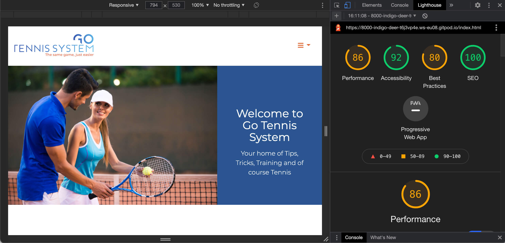    
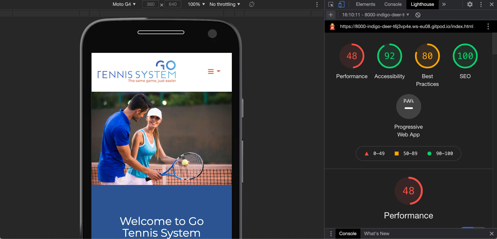     
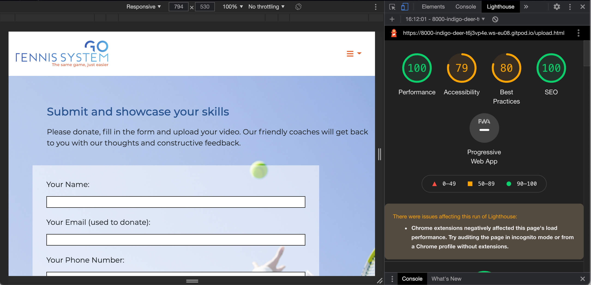   
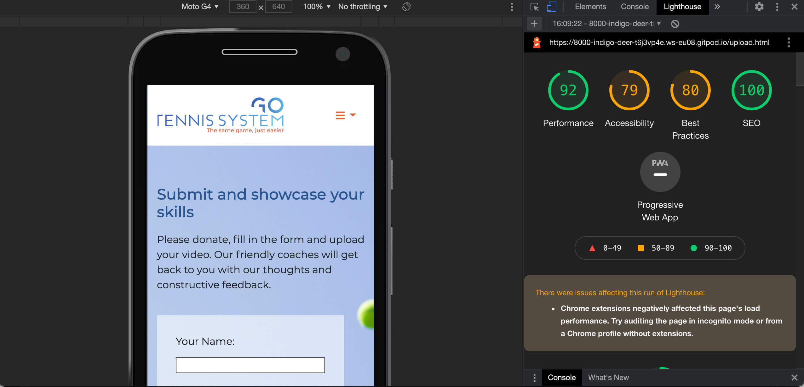   
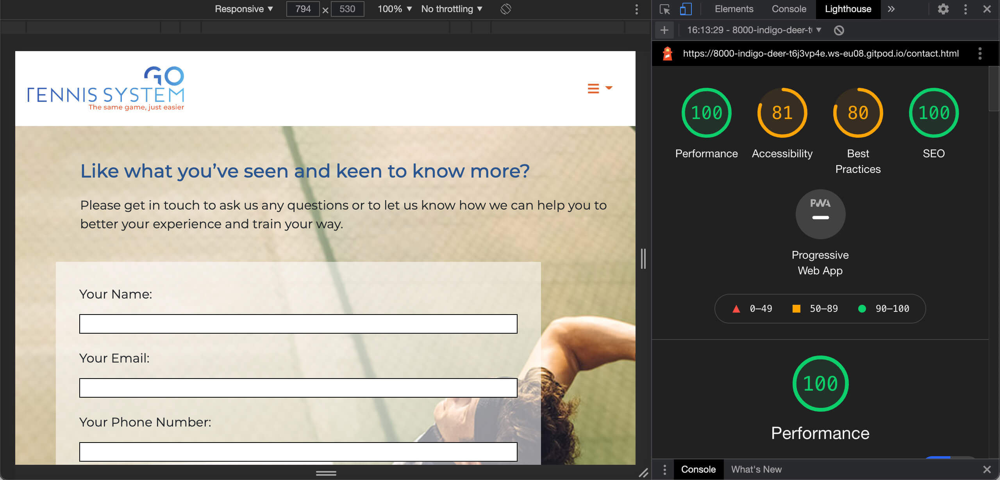    
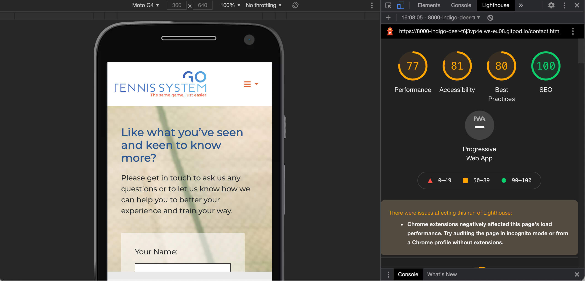   
   
I have used the W3 validator to check my HTML and CSS code as well and have the following results below:

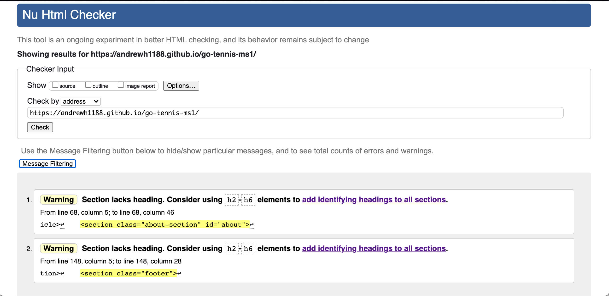   
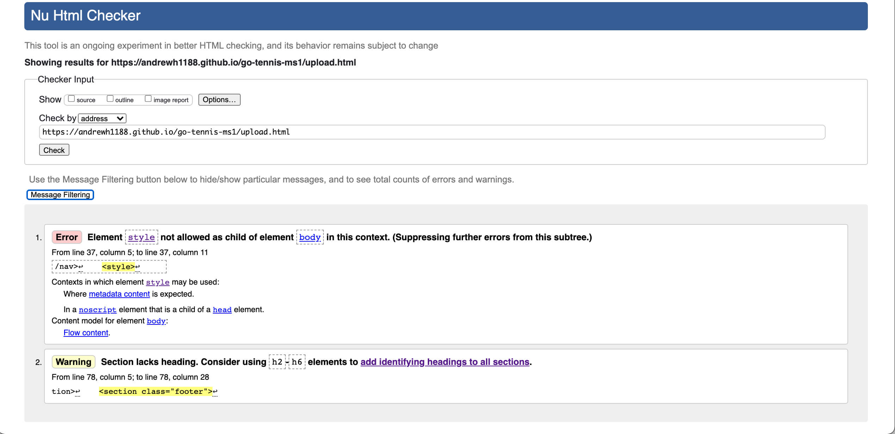   
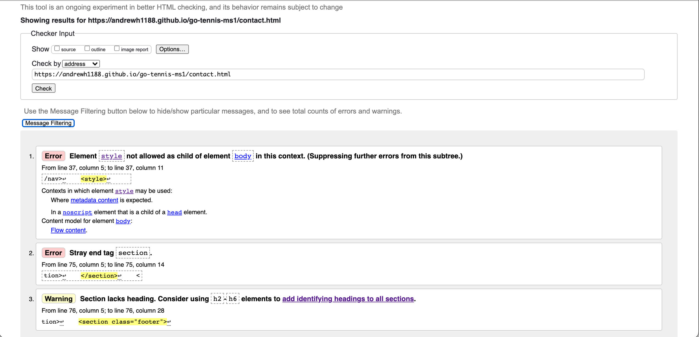    
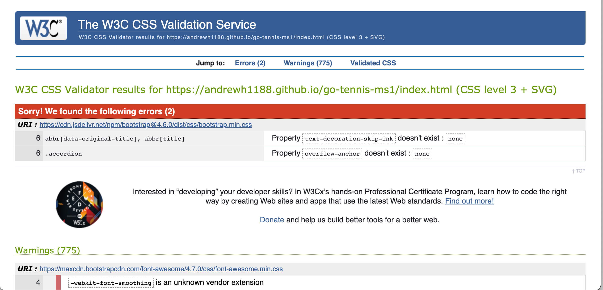  

In regard to the warnings for the index/home page there were many to start with, but the ones remaining I dont think are a real issue. The reason I think this is because 
the about ID is required to link the about section in the nav menu. I did remove this but then couldn't access this from the nav bar. The other warning regarding the footer section
I believe requires no action because this is for the blue box only, therefore there are no h2-h6 elements there which is why I have left these for all pages.
The Upload and Contact have warnings and these relate to the background images, I have tried to fix these but was unable too, hence why these are still showing.
Although there are many warnings for the CSS these all come from the Bootstrap and I'm not sure how to fix these.

I have since made alterations so the scores for these and errors for these have changed as shown below
    
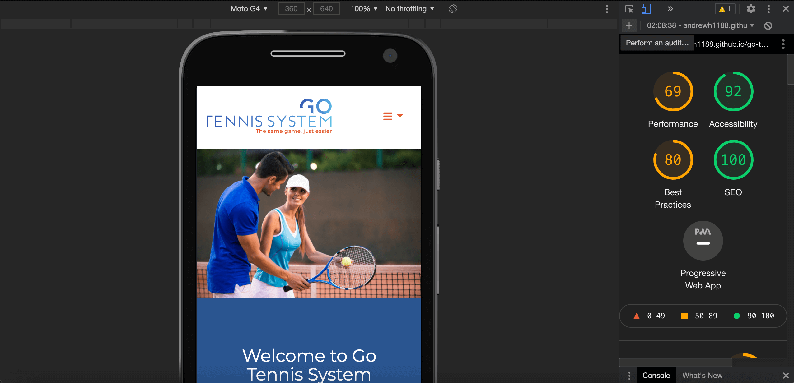     
   
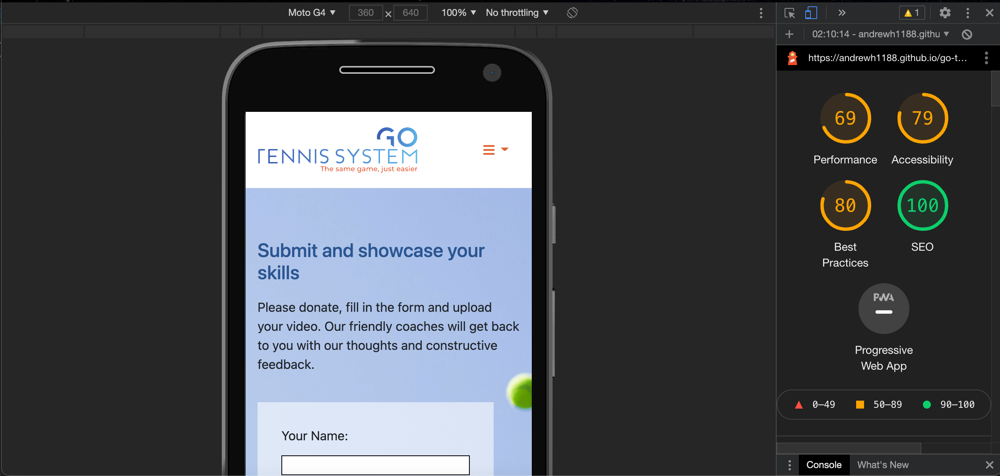   
    

Looking at the home page on mobile it is very encouraging to see that the score has altered since I have made alterations and there are no red indicators on any pages anymore.

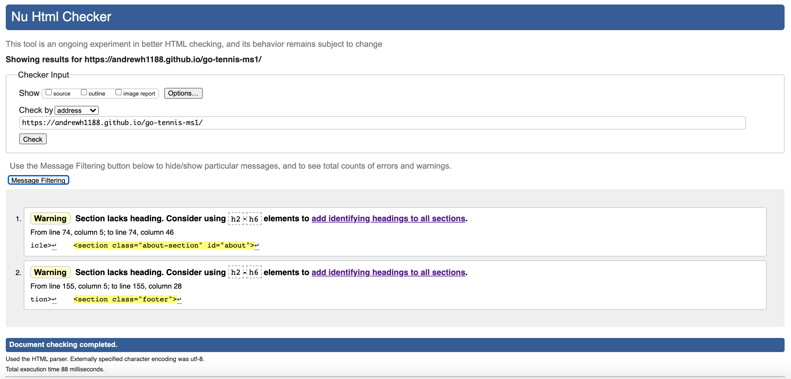   
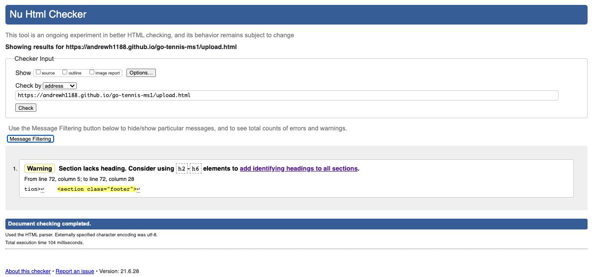   
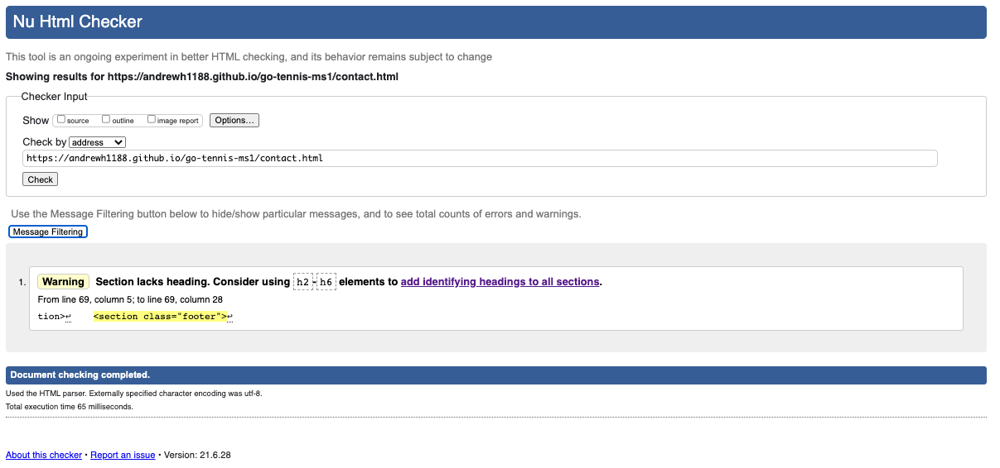    
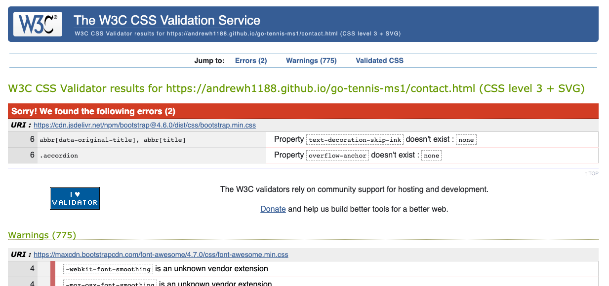

Since changing the background to having this in the CSS the only error that shows is the footer and the about id. But like I said above I'm not overly worried about these issues. The SCSS from Bootsrtap is still an issue, 
but I don't believe I can change this.

## Bugs
### Background Images
When I tested on smaller screens I had issues with the forms on the Upload and Contact pages. At first these were below the footer then overflowing behind the footer and were covered. To resolve these issues I put in Media queries
which give quite a gap, but at least they can be seen and enable the user to use the forms as intended. There were other issues with my friend Bootstrap (or rather me) not copying across sections correctly, the main parts were Container, Row, Column for the grid structure.

### Bootstrap Grid
I had left out the container from the Bootstrap Grid, although having not used Bootstrap without a video showing me it was an easy mistake to make and one that I have remembered and learned from with Antonija's help. 

### GitPod
I have had issues with GitPod which lead to me starting again on a couple of occasions. The main issue I was having was the commits were not going through and files were not pushed to my repository. This was because I was doing the commit message wrong as I had left out the -m. 
After a bit of Googling I and restarting I was on my way again to create something as you see in the live link, and my code.

### Footer
As mentioned before I have had fun with the footer on a few occasions and have even set up [test files](/workspace/go-tennis-ms1/test-files) folder with files for the footer in the footer test and even started in the test file as well as a file for testing the Upload background.
To overcome the footer fiasco I resorted to Bootstrap in order to give me what I required and would like to see. I did have issues with the alignment when this was on a smaller screen, but added the media queries to fix this issue.

### Carousel
I had a hard time getting the images and text to display correctly in the Carousel section, so I made the slides in Adobe Indesign and exported them out as jpgs and then loaded them in to the images folder.  

### Nav bar colours and fonts
I had issues with fonts in the nav bar, but later found out the Font Awesome i tag was causing this as I had put this in the wrong place, and so when I tried to target the font this wasn't working. Relocating the i tag made this work as expected.
The issue with colours was because I was targeting the a tag, this also had a knock on effect with the footer social media icons as they took the same colour too. On specifically targeting the right section with CSS this resolved the issues.

### Dropdown menu nav bar
When I first started I had written the nav bar and didn't know how to get this to look or perform as expected. I tried Bootstrap and found something close but wasn't happy that this was pushing the content down. After having my mentor session with Antonija she showed me one that was better and a lot closer 
to what I was expecting to see as per my design.

### SVG Logo
The SVG logo and the slogan were creating a white box top and bottom and this was causing issues with the nav bar height. After finding and using [Online Convert.com](https://www.online-convert.com/result#j=3365cf39-bec6-4042-963c-4dbdf9f70817) I was able to make a workable logo without the background interfearing
and this resolved the nav bar height issues.

### Upload file chooser
When I first started I had forgotten that there are elements that you can select the file and upload it. I did try to style this but it wasn't working, so for now have left this as there were many other pressing issues.

## Deployment:
I used GitPod to write the code, upload and store images and relevant files associated with this project. With GitPod being linked to GitHub I was able to use the terminal in GitPod to add, commit and push my code to their server. 
This project has been deployed using [GitHub Pages](https://pages.github.com/) which has made my site live for all to view and even test the features of this site. This is also available as part of my growing portfolio for potential employers to view as well as for me to see how much I have grown on my way to completing the Full Stack Web Development Course. Having the site live saves the user having to fork or clone my code for themselves.

To deploy this site I took the following steps:

1. Click on the Repositories tab in GitHub.
2. Click on the go-tennis-ms1 link which is at the top of my repositories. This is here as it is the most recent file I have been working on. 
3. Click the settings tab.
4. Scroll all the way down near the bottom to [GitHub Pages](https://pages.github.com/) which now has its own dedicated tab.
5. Click the Check it out, which will take you to GitHub Pages.
6. Where it says Source, click the dropdown and set this to master.
7. Click save and then wait a few minutes before clicking on the link to view your live masterpiece.

You are more than welcome to run this project locally yourself, and if you would like to do this you will need to do the following:
1. Click on go-tennis-ms1 link which is at the top of my Repository in GitHub.
2. Click on the dropdown arrow where it says Code.
3. Click Clone, Open GitHub Desktop or Download ZIP.
4. Open in your preferred IDE.
5. Run on your preferred server.

## Credits:
* [Code Institute](https://codeinstitute.net/) I used some of the CSS and HTML for the Upload and Contact forms.
* [README.md](https://github.com/Code-Institute-Solutions/readme-template) Code Institute again for an in detailed README.md which has been very valuable and has allowed me to complete this in such fine detail as I have. 
* [Font Awesome](https://fontawesome.com/) for the many icons that I have used throughout the various pages.
* [Bootstrap](https://getbootstrap.com/) We have had fun along the way, but over all for your superb features that you provide to enabled me to add in without having to code too much myself, although there was quite a bit of tinkering with the CSS, but we're still friends.
* [Adobe Stock](https://stock.adobe.com/uk/) for the vast array of superb images.
* [101 Computing.net](https://www.101computing.net/html-how-to-add-a-favicon/) was used to get the code for adding the Favicon across all pages.

## Content:
The bulk of content on this site has been written by myself in order to give the website information, purpose and meaning.
My tennis coach and superb friend Adam Jameel provided the section about himself which is in use on the page under the About Us - Coach Adam Jameel section.
I have spent many months in preparation for this website chucking many an idea at Adam for his approval, suggestions or amendments, and he has been too kind to allow them all.
One other point I would like to make is that the Go Tennis System and the slogan The same game, just easier are also what Adam sent to me. I produced the stylish Logo that has been used in the Nav bar and the Go which has been used in the favicon, which I made in Adobe Photoshop.

## Media
* All images were purchased from [Adobe Stock](https://stock.adobe.com/uk/?mv=search&as_channel=sem&as_campclass=brand&as_campaign=UK%7CCPRO%7CStock%7CPURCH%7CNew%20%26%20Repeat%20Buyers-RLSA_Brand%7CGG%7C%7C&as_source=google&as_camptype=acquisition&sdid=TY6XL496&ef_id=CjwKCAjwrPCGBhALEiwAUl9X06O2_Zi-uMJ6h6CqFPz7BFhKUapP5stL_qYPzZUAsp_XHaKUbeV6FRoC8sMQAvD_BwE:G:s&s_kwcid=AL!3085!3!513339005998!e!!g!!adobe%20stock!12549248811!123274014950&gclid=CjwKCAjwrPCGBhALEiwAUl9X06O2_Zi-uMJ6h6CqFPz7BFhKUapP5stL_qYPzZUAsp_XHaKUbeV6FRoC8sMQAvD_BwE) and have been credited in the Imagery section with the link, file # and the name of the owner who kindly uploaded the image(s) for people to download for their use.
* I have made every effort where possible throughout to credit wherever I am able too.

## Acknowledgments 
Firstly I would like to thank my Mentor Antonija Simic for honest, helpful and continuous feedback, without this I wouldn’t have been able to design nor create something like I have, nor would I have pushed myself to learn new code or try new ideas either. Antonija has been absolutely superb to work with and has sent me vast amounts of inspiring material in order to help me achieve this superb site. 
I really enjoy our mentor sessions together and can't thank Antonija enough for all the help and support that has been given to me. Thank you again Antonija, I really appreciate all of your help and support.  
I would like to also thank Ulysees and Alexander in Student Support as well as Jo, Tim, Stephen, Igor, Scott, and the Tutor Support team at Code Institute for bearing with me, being so understanding as well as helping me to find the gremlins in the code as well as my errors. I would also like to thank Tutor Support for all their support that they have given to me to enable me to complete this project.  
I would also like to thank the [Stack Overflow](https://stackoverflow.com) and [Slack](https://slack.com/intl/en-gb/) Community for helping me fix issues and errors.
I would like to also thank my friend and Tennis Coach Adam Jameel for allowing me to do this project and use his business as the focus of my project as well as for his support too. I promise one day I will revisit this site once I have graduated and will produce something out of this world.  
I would also like to thank others such as Stuart Crang at The Learning People Global, Jim Jenner my Tinnitus friend who I help, my Mum, Aunt, Uncle, Councillor friends Sarah Madigan and Caroline Wilkinson for their encouragement and support. It really means a lot to me and has picked me up, as well as kept me on track even if they know nothing about what I am doing (apart from my Uncle and Stuart).

My Tennis Coach and superb friend Adam Jameel kindly let me loose on this site, which I and he hope will be able to serve him and his business one day not too far in the future.

Created by Andrew Harding