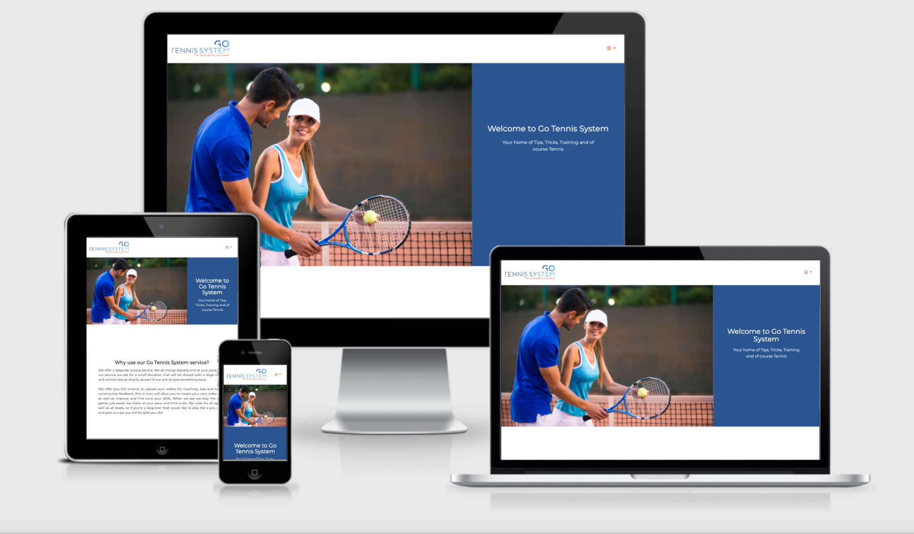

# Go Tennis System

This is a website designed to help people interested in one on one tennis coaching recieve this online. By putting this service online it doesn't restrict where abouts the user
is in the world or any problems like the pandemic of which we are currently facing. Also this will help users with their own video. diary so they can see how much they have progressed.

## Showcase

A deployed version of my website can be found [here](https://andrewh1188.github.io/go-tennis-ms1/)

This domain will allow you to access the Go Tennis System website, which I have completed as part of the Code Institute Milestone 1 Project.

This website is designed to be responsive on a range of devices and browsers, allowing access to anyone that is interested in the service Go Tennis System are offering.

## Table of Contents
1. [User Experience UX](#user-experience-ux)
    * [User Stories](#user-stories) 
        * [As a new / first time user](#new-first-time-user)
        * [Returning Visitor Goals](#returning-visitor-goals)
        * [Frequent User Goals](#frequent-user-goals)
        * [User Customer Goals](#user-goals)
        * [Business Goals](#business-goals)
        * [Scope](#scope)   
        * [Structure](#structure) 
    * [Design](#design)
    * [Imagry](#imagry)
    * [Wireframes](#wireframes)
2. [Features](#features)
    * [Existing-features](#existing-features)
    * [Future-features](#future-features)
3. [Technologies and Languages Used](#technologies)
4. [Testing](#testing)
5. [Deployment](#deployment)
6. [Credits](#credits)
    * [Content](#content)
    * [Acknowledgements](#acknowledgements)

## User Experience UX 
I have designed this website for my Tennis coach Adam Jameel who is starting up his own business.  
This website is to allow users to have video lessons and tutorials wherever they are in the world.  
This has been bought about because of the current pandemic and my Tennis coach wanting to keep people fit, training as well as keep their physical and mental health on form.

## User stories 
*  As a new / first time user / potential customer I would like users to learn more about the organisation, as well as easily understand the goals that this site is offering.
*  As a new / first time user / potential customer all content will be easy to navigate through in order that the user finds what they are looking for quickly, this will provide the user with a great friendly user experience and transform them into a returning and frequent user of the site.
* As part of the new / first time user’s / potential customer's experience there will be all the information such as customer feedback in the way of testimonials. This is to help them make an informed decision about the service that Go Tennis System has offered, and can offer you. There will also be social media links so you can follow Go Tennis System and see their new  posts, as well as provide another form of interaction to the user and Go Tennis System.

#### As a new / first time user / potential customer I would expect the questions that they would ask are:
* What will I receive?
* Why should I use Go Tennis System?
* What does this site have to offer me?
* How do I receive the coaching / feedback?
* How much is the coaching / feedback service?
* Is this unique to me?
* How do I do the shot / how can I perfect my shot and how can this help my game?
* How do I do something that isn’t how everyone else does it, for example how can I be  unique?
* Does this service offer coaching to suit me at my level and can I progress?

#### Returning Visitor Goals  
* As a returning user / customer I would like to be able to see updated relevant content.
* As a returning user / customer I would like to find the relevant information that helps me progress as well as any offers that may be available for me to take advantage of.
* As a returning user / customer I would like to be able to have the content delivered in a way that is easily understandable and relatable to me and what I am looking for.

#### As a returning user / customer I would expect the questions that they would ask are:  
* Is the content being refreshed / new content being added / updated?
*  Are there any discounts or offers that I may be able to use / take advantage of?
*  How do I perfect my shots from my current standard?
*  Is the information relatable and understandable?
*  Is the information helpful to me with what I would like to and how I would like to achieve this?

#### Frequent User Goals. 
* As a frequent user / customer I would like to be able to see relevant updated content 
* As a frequent user / customer I would like to be able to see where there are events taking place near me that I may be interested in and like to go and join in with. In doing so this will enable me to put into practice what I have learned and also learn through playing others too.
* As a frequent user / customer I would like to be able to see items that will get me involved with Go Tennis System, a few examples maybe meet up events, one on one with my coach, pairing me with someone else of maybe the same standard or slightly better, in doing this it will enable me as the user of the Go Tennis System to really feel a part of this, and also put my skills to the test. I would also like to see other such customer focused activities that will help me in my player development. Other things to be included could be email newsletters with Top Tips, Tricks and Training guides and exercises to help me before and after my  session(s).

#### As a frequent user I would expect the questions that they would ask are:
* How can I go from my current standard to the next / advance?
* What new tips, tricks, tactics and ways  are there to implement what I have learned?
* Are there any strategies for games?
* How do I perfect my shots from my current standard that I’m at to maybe / be able to go on and compete socially or in tournaments?

I would expect the bulk of new, returning and frequent users to be at a beginner level, although would say that there will be users that have been playing that are not beginners and want to learn more, as well as perfect what they have already learned / know.

#### User/Customer Goals
The user/customer goals that Go Tennis System will offer to provide to users are:  
* As part of the ability to upload/submit their video the user/customer will be asked for a donation. Part of this will go to a dogs charity or an animal rescue that members of Go Tennis System are associated with. Part of the donation will go to help with running costs of the site as well as pay for the assessors time and knowledge.
* The ability to upload/submit the users footage: Upon having contributed a donation the user/customer will receive a focused, helpful service by means of coaching to enable them to improve their skills by the assessor. Video footage as well as tips, tricks and training will help the user to enhance their shots, increase their understanding and fine tune their skills. 
* This service is online only, this will enable users/customers the ability to receive feedback whatever the current outlook of the world, or wherever in the world they are located. Also in doing the training online this allows the user to take the training at their own pace, practice anywhere they are able to do so, as well as at a time to suit them.
* By using the Go Tennis System video uploading service users/customers are able to form their own video diary of their progress. They will be able to watch the video feedback and coaching they receive and document their journey from the day they started out to the level they want to be at. There is hope that the user/customer will continue to take advantage of offers and USPs (Unique Selling Points) enabling them to train more so that should the customer/user wish to this will enable them to compete socially as well as in matches/tournaments. 

#### Business Goals  
The business goals and outcomes that Go Tennis System want to receive from this website are:
*  Reaching out to new users/customers in having another platform (the website) in which users will be able to find them.
*  In having the website have the users/customers interact with this by means of uploading their videos for coaching/assessment.
*  Retain customers through USP (Unique Selling Points) and offers that make Go Tennis the go to place for this kind of service. To go on and add a subscription service to give users/customers the sense of commitment and to retain them too. Yes ok you could watch YouTube videos, but most often these steps are not relevant to the player watching, the reason is the player watching will want to play their way, a way that is comfortable and controllable to them (at the start, as playing matches/tournaments users will be expected to play to the standard of the other player if not better, if they are to really compete).
*  By providing coaching at your level and pace this will help with confidence for the  users/customers, meaning they will interact with the site more often as they seek to improve and learn, this will give the website stable traffic to start with but over time the more users, the more the business can grow.

#### Scope  
I want my users to easily understand and learn what Go Tennis System has to offer them and have achieved this on the home page whilst giving the user the ability to contact for any information that may have been overlooked when putting together the text.

#### Structure
I have incorporated the about page into the home page as this flowed better especially with the carousel of testimonials. 
I have been able to add the ability to chose the file the user wishes to upload and have been able to make the uploads process a lot cleaner and easier to use for the user which is great for UX.
After my mentoring session with Antonija it was decided that the new layout was a lot better, but with some small tweeks this would look amazing. I took out a lot of the coloured heading bars and 
made the footer completly blue with the white logos and text. I think if I had a bit more time I would have looked into adding a subscribe part to the page, although this could be a part on its own
page as I wouldn't want to make the page appear too cluttered.

## Design
The site is designed over three pages although has four links. There is the index which also houses the about section, uploads and contact pages which are stand alone.
The links all work and connect to the relevant page or section of the project.

The main font that I will be using is Montserrat and will add the fall back of Sans Serif in case the browser can not load the default font, or this isn't imported. 
I have used Meedori Sans for the Go Tennis logo and Montserrat for the slogan 'The same game just easier' that I produced in [Adobe Illustrator](https://www.adobe.com/uk/products/illustrator.html).
I have kept with the Montserrat font throughtout the site to keep with consistency and to tie everything in together, as well as keep a clean look and feel.

I chose the colours based on the brief I was given by Adam my Tennis Coach as he likes blue and the orange compliments this nicely.

## Imagry
The Go Tennis System Logo and Slogan that is incorporated in the logo I will design using [Adobe InDesign](https://www.adobe.com/uk/products/indesign.html) and then will export out as an SVG to make this able to load. When I had my first Mentoring Session with Antonija I asked how best to export the logo so this loads all the time and an SVG file was the best option Antonija said will load and not be broken across different browsers.

With some of the imagery I will download this from [Adobe Stock](https://stock.adobe.com/uk). The images will be Tennis related as this is what the site is about and what the service offers. The images will grab the viewers attention as well as support the site content. The Hero image for the front page will work nicely and will offset / complement the layout. 

The images will also be simple and not overpower any text or messages that are on the site but will seek to support them.

I will also have logos on the site that I will need to download to go in the footer. One of these logos are Babolat who sponsor Adam the Go Tennis founder and coach. Another is LTA that will also sit alongside the Babolat Sponsor logo.
For the Supporting logos one will be a placeholder image/logo for now as I have yet to find out the actual dogs charity that Go Tennis System is supporting. For now I have chosen The Dog's Trust logo. The other will be the Chesterfield Animal Rescue that I will take from their site.
 
I have downloaded the following images from [Adobe Stock](https://stock.adobe.com/uk):

1. [Man training woman how to play in tennis](https://stock.adobe.com/uk/images/man-training-woman-how-to-play-in-tennis/90821107)  
    * file #: 90821107 
    * Photo uploaded to Adobe Stock by Drobot Dean

The hero image on the Home page (index.html) was selected because it shows tennis coaching, I thought it would fit with the theme as this is what the site is mainly about and targeted towards the service that it has to offer. 
I believe the image shows the fun in the learning without showing the users experience / player level, although we could assume that the level could be beginner because of how the coach is holding the racket with the student. 
I know from having received tennis coaching this is useful at any level as it helps the person being coached/student to identify how to correctly hold the racket for the shot they wish to learn or play. I believe this image fits in well with the rest of the home page and is not too overbearing, but also doesn’t get lost either. 

2. [Beautiful female tennis player serving](https://stock.adobe.com/uk/images/beautiful-female-tennis-player-serving/128935730)  
    * file #: 128935730
    * Photo uploaded to Adobe Stock by NDABCREATIVITY

This image was used as the Upload page (upload.html) background as the player is reaching up for the ball in the serve that she is doing. 
I tied this in with upload and thought this would be a sort of subtle blend between the two, although I’m not expecting users to make this connection, but the image works well with the layout and that is key to good design and user experience. 
In order for the form to show I will overlay a transparent box to help users see the form better.

3. [Tennis player serving in the match](https://stock.adobe.com/uk/images/tennis-player-serving-in-the-match/283177782)  
* file #: 283177782
* Photo uploaded to Adobe Stock by Jacob Lund

This image was used as the Contact page (contact.html) background because the player is reaching out to hit the ball, also in reaching out you can say, if you have any questions just reach out to us. 
I’m not expecting the users to make the connection between the image and the sayings. The image complements the page layout and colour theme too. So users are able to use the contact form I will overlay a transparent box to help users see the form better.

## Wireframes
The original wireframes can be found [here](/workspace/go-tennis-ms1/original-wireframes.pdf)
These wireframes were very basic and all pages were going to look the same. After having my first mentor session with Antonija Simic I set to work to create something a lot different, but with some elements that were the same.

### Changes to wireframes
To view the new wireframes that I have created using [Balsamiq](https://balsamiq.com/wireframes/?gclid=CjwKCAjwieuGBhAsEiwA1Ly_nRpVy2nQlPQyvPKufSrbI7syDEct7PMuOmzBSyoyuDh_ofosfd1V8BoCI20QAvD_BwE) please click [here](/workspace/go-tennis-ms1/wireframes.pdf) .  
my mentor Antonija Simic said looked good but needed some parts removing as it looked too much like a newspaper.  
The wireframes haven't been changes as there were minimal changes but the actual site that has been produced as the final outcome shows these changes. These changes are mainly removing colours from behind headings as well as changing some colours to suit better in areas such as the footer and the about us section to make this look more like a website and less like a newspaper.  
In respect of the design the changes that have been implemented look a lot better on the actual site. I have the designs here that were then done in Adobe Indesign based on the helpful and constructive feedback from my mentor Antonija Simic. 

All of the wireframes have been uploaded into the same PDF for ease of accessability.

## Features
This section is a brief highlight of features that this site contains, why they are the way they are as well as any future improvements or additions that would take this site from strength to strength.
* All pages are to be visually appealing with the home page as the landing page giving users the information they require.
* The about section has been incorporated in the home page as this fits well with the rest of the content, namely the carousel at the bottom of the page.
* The nav bar I have enabled the about link to jump to this section on the home page, making this user friendly.
* The nav bar allows users to quickly jump between the pages and also show the user which page they are on as the active link is a different colour. The links all have a hover colour too in order to show this is an active link.
* The nav drop down has the hamburger icon which works well on desktop as well as smaller devices such as phones or tablets.
* The contact form allows users to get in contact with any questions they have like pricing or trouble with uploading etc (This will be linked to the correct address in the future). 
* This website is responsive on all browsers and devices regardless of viewport size
* Elements are interactive to engage users to visit and interact with and engage with the site as intended.

### Exhisting features
* The user can fill in their details, donate and choose their video to upload then submit this for feedback and coaching on the uploads page.
* The footer has the ability for the features to stack on top of each other with a thin horizontal rule to break up the sections.
* The links to the footer also have the hover function and link to the social media sites and have the ability through the Whatsapp to open Whatsapp and send a message. 
* I have created a basic favicon in order to personalise the site a bit more and give it a bit more of a finished feel.

### Future features
* The Facebook and Instagram link to the correct pages although the Youtube and Whatsapp will be linked to the correct page and phone number.
* Link the Upload and the Contact forms to the correct email address / location.
* For a future section I would like to compile all the FAQs or Frequently Asked Questions and have this as another page in order to better help and serve the user / customer.
* In order to keep the page fresh and relevant I would like to change the hero image, add new testimonials from actual users as well as update / expand the existing text.
* I would in future like to incorporate this website into an easy to use app, in the app I would like this to hold all of the coaching videos and give the user the ability to view the content through a subscription service.

## Technologies and Languages Used
This project was built using the following languages and technologies:

## Languages:
* [HTML5](https://en.wikipedia.org/wiki/HTML5)
* [CSS3](https://en.wikipedia.org/wiki/Cascading_Style_Sheets)

## Libraries frameworks and online resources:
* [Bootstrap 4.6.0:](https://getbootstrap.com/docs/4.6/getting-started/introduction/)
    Bootstrap was used to help with the styling of the website in forming the grid layout as well as aid the responsiveness of the site.
* Google Chrome Dev Tools: For testing purposes.
* Lighthouse: Used for testing website performance, check for Performance, Accessibility, Best Practices and Search Engine Optimization (SEO).
* [Google Fonts:](https://fonts.google.com/)
    Google fonts was used to import ‘Montserrat’ font into the HTML which is used on all pages throughout the project.
* [Font Awesome:](https://fontawesome.com/)
    Font Awesome icons were used on all pages throughout the website. The majority of these were in the Menu as well as the footer for the Social Media icons. I have added other Font Awesome icons to buttons as well as for the PayPal icon for the donate.
    * Here are a list of Icons that I have used within my site for the different pages/sections. These have all been styled using CSS. I have called the style tags the following:
        * [Hamburger Menu Icon](https://fontawesome.com/v5.15/icons/bars?style=solid)
        * [Home](https://fontawesome.com/icons/home?style=solid)
        * [About Us](https://fontawesome.com/icons/address-card?style=regular)
        * [Upload](https://fontawesome.com/icons/upload?style=solid)
        * [Contact](https://fontawesome.com/icons/paper-plane?style=regular)
        * [How we can help you](https://fontawesome.com/icons/info-circle?style=solid)   
        * [Coach Adam Jameel](https://fontawesome.com/icons/user-friends?style=solid)
        * Donate using [PayPal](https://fontawesome.com/icons/cc-paypal?style=brands)
        * Contact Us [Submit](https://fontawesome.com/icons/envelope?style=regular) Button
        * [Facebook](https://fontawesome.com/icons/facebook-square?style=brands)
        * [Instagram](https://fontawesome.com/icons/instagram?style=brands)
        * [YouTube](https://fontawesome.com/icons/youtube?style=brands)
        * [Whatsapp](https://fontawesome.com/icons/whatsapp?style=brands)
fa-menu - this allows me to easily target only the menu icons with the CSS page  
fa-article - this allows me to easily target only the article icons with the CSS page  
fa-button - this allows me to easily target only the button icons with the CSS page  
fa-social - this allows me to easily target only the social media icons with the CSS page  
* [W3C HTML-validator:](https://validator.w3.org/) Used to find mistakes in my HTML code and try to fix these. 
* [Jigsaw:](https://jigsaw.w3.org/css-validator/) Used to find mistakes in my CSS code and try to fix these.
* [Tiny PNG](https://tinypng.com/)  
    Tinypng was used to compress image sizes without loosing the quality. This is so that the website isn’t loading images that are large in storage size, but also so that the website can load the images and doesn’t keep users waiting as well as increasing the load time which would provide a bad UX.
* [Online Convert.com](https://www.online-convert.com/result#j=3365cf39-bec6-4042-963c-4dbdf9f70817)  
    Online Convert.com was used to change the Go Tennis Logo into a workable SVG image

## Tools:
* [Git](https://git-scm.com/)  
    Git was used for version control having set up the GitPod terminal to commit and push to GitHub. 
* [GitHub:](https://github.com/)  
    GitHub is used to store the code from the project after being pushed from Git.
* [Balsamiq:](https://balsamiq.com/)  
    Balsamiq was used to create the [wireframes](/workspace/go-tennis-ms1/wireframes.pdf) during the design process.

## Programmes:
* [Adobe InDesign](https://www.adobe.com/uk/products/indesign.html) Adobe InDesign was used to create the Go Tennis System logo, as well as a visual for what I would like the finished pages to look like. In Adobe InDesign using font Meedori Sans Regular I created the Go Tennis System Logo. I gave this a gradient and positioned the Go to the right.
* [Adobe Photoshop](https://www.adobe.com/uk/products/photoshop.html) Adobe Photoshop was used to resize logos for the website.
* [Adobe Illustrator](https://www.adobe.com/uk/products/illustrator.html)Adobe Illustrator was used to convert the Go Tennis logo to an SVG file.

## Testing ()

## Deployment ()

## Credits ()

## Content ()

## Acknowledgements  
Firstly I would like to thank my Mentor Antonija Simic for honest, helpful and continuous feedback, without this I wouldn’t have been able to design nor create something like I have, nor would I have pushed myself to learn new code or try new ideas either.  
I would like to also thank Ulysees and Alexander in Student Support as well as Jo, Tim, Stephen, Igor, and the Tutor Support team at Code Institute for bearing with me, being so understanding as well as helping me to find the gremlins in the code as well as my errors. I would also like to thank Tutor Support for all their support that they have given to me to enable me to complete this project.  
I would like to also thank my friend and Tennis Coach Adam Jameel for allowing me to do this project and use his business as the focus of my project as well as for his support too. I promise one day I will revisit this site once I have graduated and will produce something out of this world.  
I would also like to thank others such as Stuart Crang at The Learning People Global, Jim Jenner my Tinnitus friend who I help, my Mum, Aunt, Uncle, Councillor friends Sarah Madigan and Caroline Wilkinson for their encouragement and support. It really means a lot to me and has picked me up, as well as kept me on track even if they know nothing about what I am doing (apart from my Uncle and Stuart).